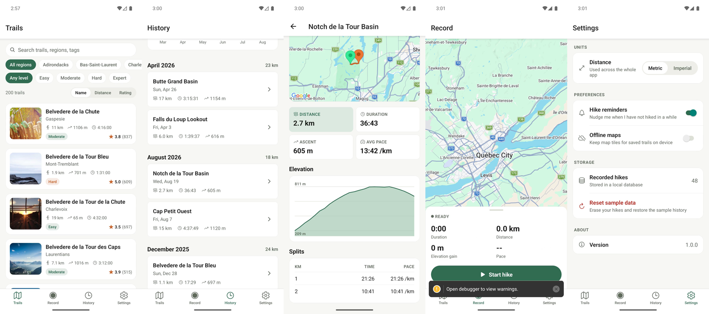

# Trailhead

A reusable Expo app for testing local `stim-cli` iOS and Android workflows.

Browse a catalogue of 200 trails with route maps and elevation profiles, record a
hike with live GPS tracking, and review your history with per-month stats and
charts.

https://github.com/user-attachments/assets/21596f10-5220-42e2-8061-237d29df3e8b



## Screens

| | |
|---|---|
| **Trails** | Searchable, filterable catalogue of 200 trails. Filter by region and difficulty, sort by name, distance or rating. |
| **Trail detail** | Route map with start/end markers and a coverage overlay, stats, description, tags, and an elevation-gain summary with average grade and high/low points. |
| **Record** | Live recording: full-screen map following your position, a draggable stats sheet with duration, distance, ascent and pace, and start/pause/stop. Backed by a background location task; saves the track to SQLite on stop. |
| **History** | Recorded hikes grouped into month sections with per-month distance, lifetime totals, and a bar chart of the last six months. |
| **Hike detail** | The recorded route on a map, an elevation profile, a stat grid, and a per-kilometre splits table. |
| **Settings** | Metric/imperial units applied app-wide, hike reminders, offline map tiles, storage and reset, app version. |

## Stack

Expo SDK 57, React Native 0.86, TypeScript, expo-router. Maps via
`react-native-maps`, charts via `@shopify/react-native-skia`, lists via
`@shopify/flash-list`, storage via `expo-sqlite` with Drizzle, preferences via
`react-native-mmkv`, animation via Reanimated and Gesture Handler.

The native projects are committed; `expo prebuild` is not part of the build.

## Getting started

```bash
npm install
bundle install
npx --package=stim-cli stim doctor
npx --package=stim-cli stim start
npx --package=stim-cli stim ios       # or: npx --package=stim-cli stim android
npx --package=stim-cli stim logs --errors
npx --package=stim-cli stim stop
```

Android builds do not require secrets. To show Android map tiles, copy
`.env.example` to `.env` and add a Google Maps API key.

For direct Expo checks, use `npx expo run:ios` or `npx expo run:android`.
Trailhead has no EAS build or simulator configuration.

The repository pins Ruby 3.3.4 and CocoaPods 1.16.2. Run direct CocoaPods
commands through Bundler, for example `cd ios && bundle exec pod install`.

See [AGENTS.md](./AGENTS.md) for how the project is laid out and the native setup
gotchas, and [bench/README.md](./bench/README.md) for the build benchmark harness.
